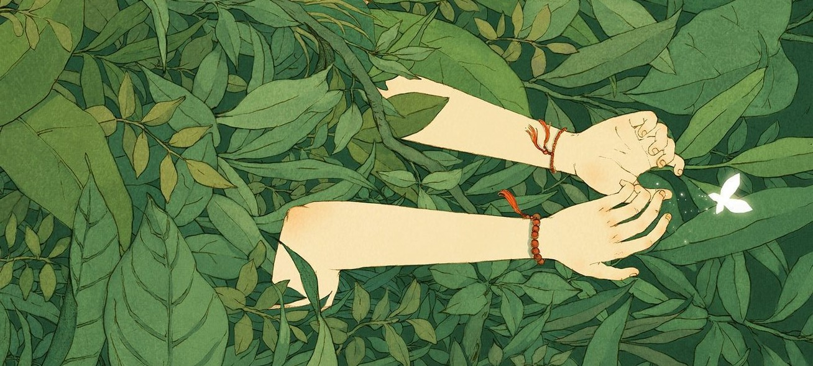
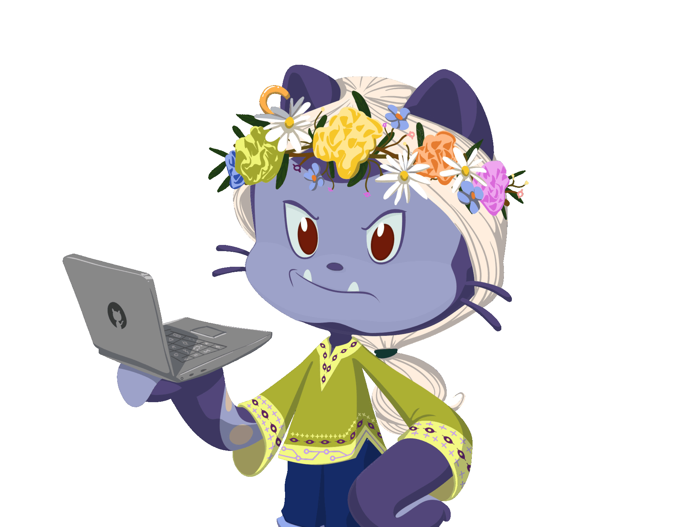

<h1 align="center">
  
</h1>

  

🔭 Trying Next.js

🌱 Currently - detoxing and debugging

👯 I’m looking to collaborate on **Deep Learning Projects**

💬 Ask me about - Anything! I might be able to help.

⚡ Fun fact - My Eyes need saving TT-TT 

<h2 align= "center">🛠️ Languages-Frameworks-Tools 🛠️</h2>

  

<h2 align="center">✨ My Github Stats ✨</h2>

  

