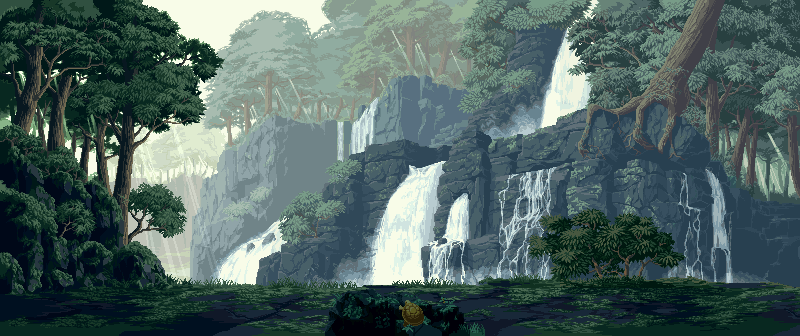
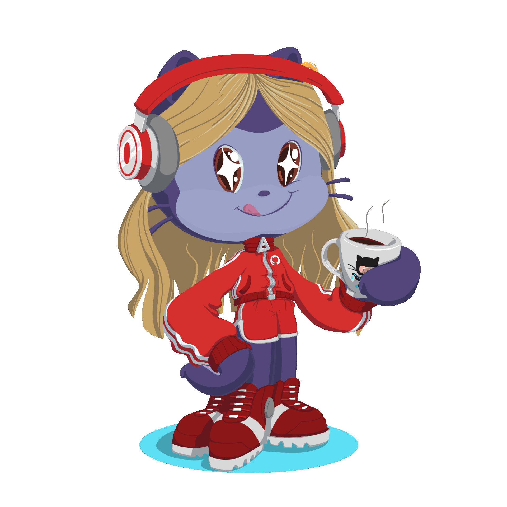

<h1 align="center">
  
</h1>

  

    - 🔭 I’m currently working on Deep Learning and AI 
    - 🌱 I’m currently learning Figma 
    - ⚡ Fun fact: Tryna break through the recursive loop of life
  

  

<h2 align="center">🛠️ Languages-Frameworks-Tools 🛠️</h2>

  

<h2 align="center">✨ My Github Stats ✨</h2>

  
   
  
   

